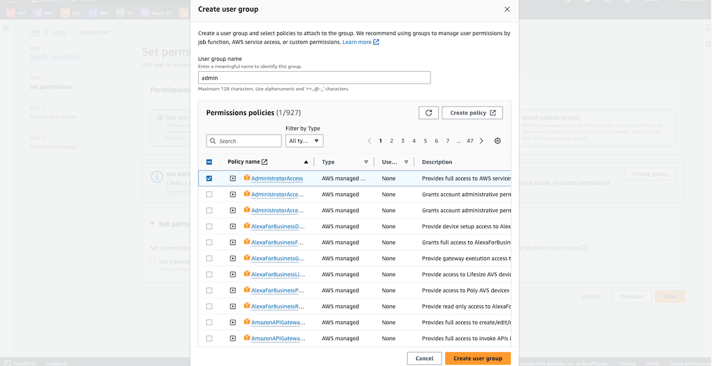

**Amazon Web Services (AWS)** is a **cloud-computing** service that is widely used around the world. It provides over 200 fully-featured services from data centers globally. Millions of customers, including the fastest-growing startups, largest enterprises, and leading government agencies, are taking advantage of AWS to **lower costs**, become **more agile**, and **innovate faster**.

Cloud computing refers to the **on-demand** delivery of computing power, database, storage, applications, and other IT resources through a cloud services platform, accessible over the internet, with **pay-as-you-go** pricing. A cloud services platform offers rapid access to flexible and low-cost IT resources, that can be used to build and maintain software and databases, and create applications that meet customer needs. You no longer need to make large upfront investments in hardware or spend a lot of time managing that hardware. You can access as many resources as you need, almost instantly, and only pay for what you use.

This is why it's worth to have an account on this platform. Don't you think? ;)

#### AWS Account Creation

So let's do this! Search for <q>aws</q> on Google and after getting to the AWS website, click on **My Account** at the top and select **AWS Management Console**. On the next page, click on **Create a new AWS account**. Enter your email address and choose a name for your account. Click on **Verify email address**. Now, go through the registration process by providing your personal details, including your address and bank card information. You'll also need to complete some verification steps. Finally, select the **Basic support - Free** plan and click on **Complete sign-up**.

After successfully registering, click on **Go to the AWS Management Console** or select **AWS Management Console** under **My Account** at the top. On the **Sign In** page, enter your Root user email, then password, and click **Sign in**.

Great, now we have an access to the **AWS console**.

#### AWS Account Usage Best Practice

It is important to avoid using the **Root account** that is created by default because it is not considered best practice and could result in financial losses if it falls into the wrong hands as it has all permissions. Instead, it is recommended to create admin users for safer account usage.

Furthermore, note that clicking on your account name in the top right corner will display your **Account ID**, indicating that you are currently signed in as a Root user, which is not desired.

We are going to use the User created with the help of **IAM service**, which stands for **Identity and Access Management**. IAM is a **Global service** that is available everywhere. With IAM, you can create new users as well as groups that users can belong to. Additionally, it is necessary to create policies that can be assigned to Groups or Users. **Policies** define user **permissions**. In AWS, the **least privilege** principle is generally applied, ensuring that the user has only the necessary permissions to accomplish their tasks.

#### IAM User

Okay, let's then proceed with the creation of a new **IAM User**.
Start by searching for <q>iam</q> in the search bar and selecting **IAM**. Once you're on the IAM Dashboard, click on **Users** on the left-hand side menu. On the next page, you'll see an option to **Create user**. Click on it.

Now, you need to provide a username for the new user and check the option to provide access to the AWS Management Console. You'll also need to select the creation of an IAM user and set a password. Additionally, you can uncheck the option to create a new password at the next sign-in - this option is helpful when creating a user for someone else. Once you've filled in all the details, click on **Next**.

On the **Set permissions** page, click on **Create group**. Enter a name for the group and check the first policy for **AdministratorAccess**. Click on **Create user group**. Now, you need to add the newly created user to the admin group that you just created. Check the box next to the admin group and click on **Next**. On the next page, review all the details and click on **Create user**. On the final page, you can check your password and save it somewhere if needed. Once you're done, click on **Return to users list** to go back to the **Users** panel where you'll see that the new user has been created.

#### Alias and IAM User Sign In

One last thing before we proceed with signing in as an **IAM User**, is to create an **Alias** for our account to avoid remembering the **Account ID** number. To do this, we have to go back to the **Dashboard** panel and click on **Create** under **Account Alias**. Next, we should choose our preferred alias and press the **Create alias** button.

After creating the alias, we can sign out by clicking on our account name on the top-right corner of the page and selecting **Sign out**. Once we are back on the **Sign in** page, we can choose the **IAM user** sign-in method, enter our alias, and click on **Next**. On the next page, we must provide our **IAM user name** and **Password**, and then click on **Sign in**.

By doing so, we will successfully sign in as the IAM user. We can confirm this by checking the top-right corner where it should state that we are signed in as the IAM user.

That's it, thanks for reading.