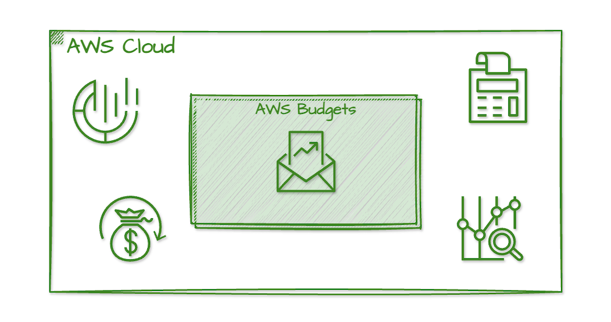
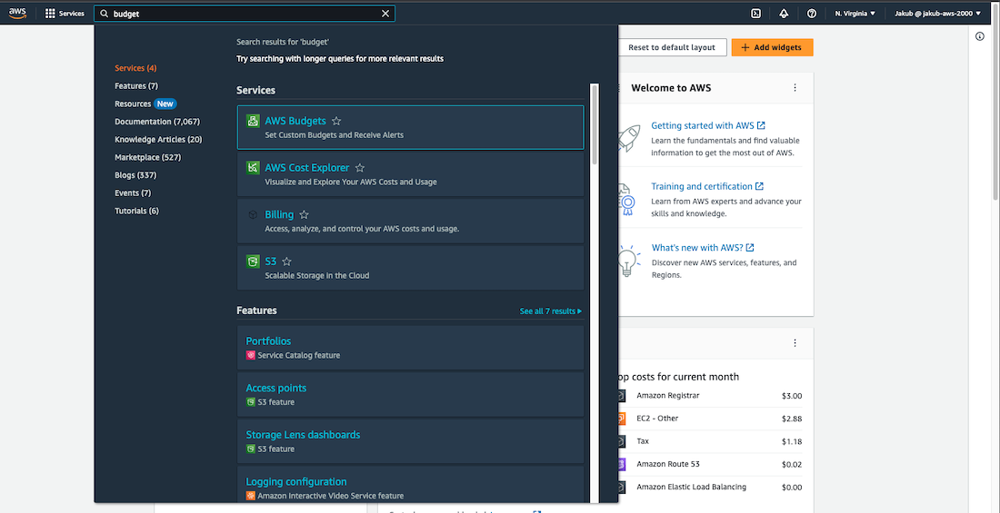
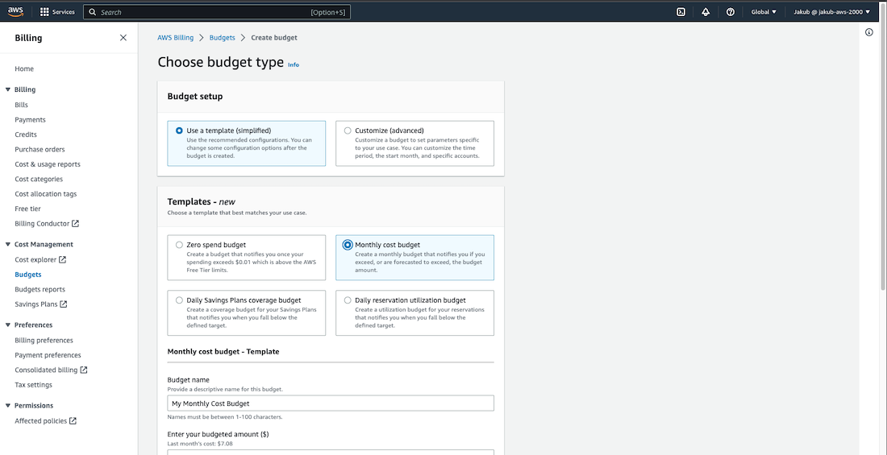
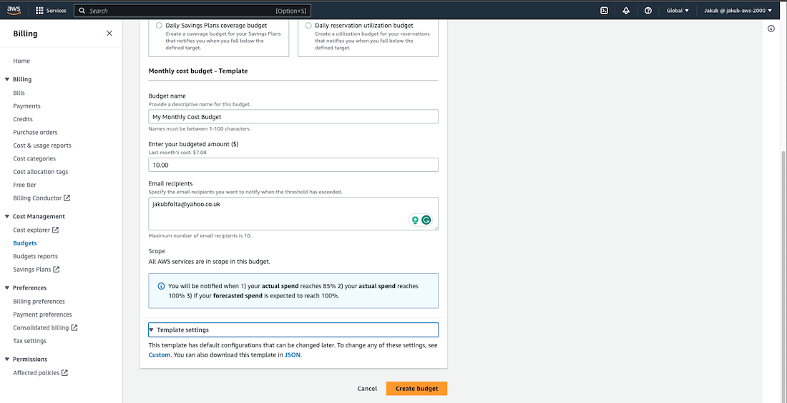
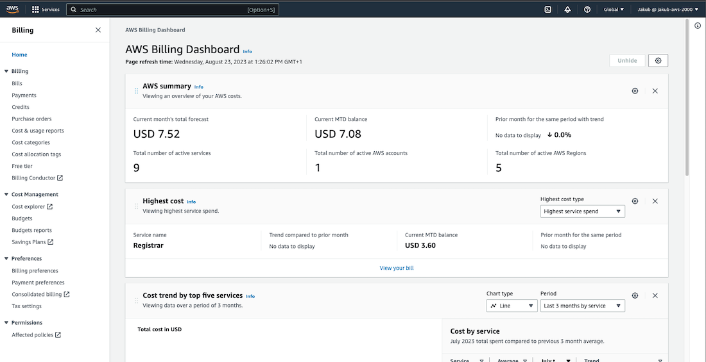
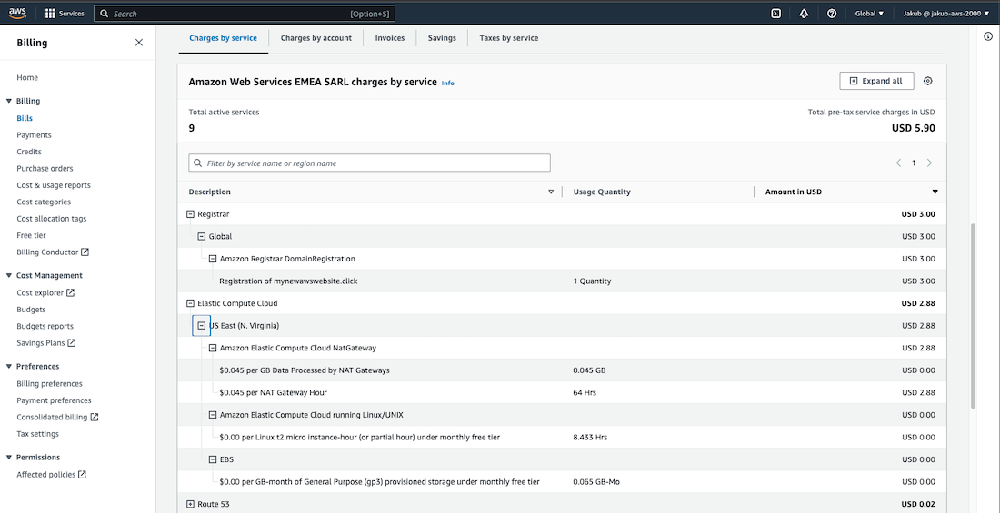

With **AWS Budgets**, you have the ability to set custom budgets for your organization's AWS costs and usage. This allows you to keep track of your spending and usage in real-time. Additionally, you can configure alerts to be sent to you via email or SNS notifications if you exceed your budget threshold. These alerts will help you respond quickly and take the necessary actions to stay within your budget, ensuring that your AWS costs remain under control.

This will be really a quick one so let's get this party started ;)

#### AWS Budgets Setup

To set up a monthly budget for your AWS usage go to the search bar at the top, type <q>budget</q> and select **AWS Budgets** from the options.

On the next page click **Create budget** to go to the configuration page. Under Budget setup select **Use a template (simplified)**, and choose **Monthly cost budget** from the Templates section. Enter a name for your budget, the budget amount you want to set, and your email so you can receive notifications about your spendings.

Click on **Create budget** to complete the setup process.

AWS services have many settings that you can adjust to your needs, but this is the quickest way to get started with budget control. 

Now, by selecting **Home** from the left-hand menu you can see what are your actual costs.

To view which AWS services and actions are responsible for your costs, select **Bills** from the left-hand menu and scroll down. This way, you can stay in control and make changes as needed.

Thanks for reading! Hope you like it ;)
