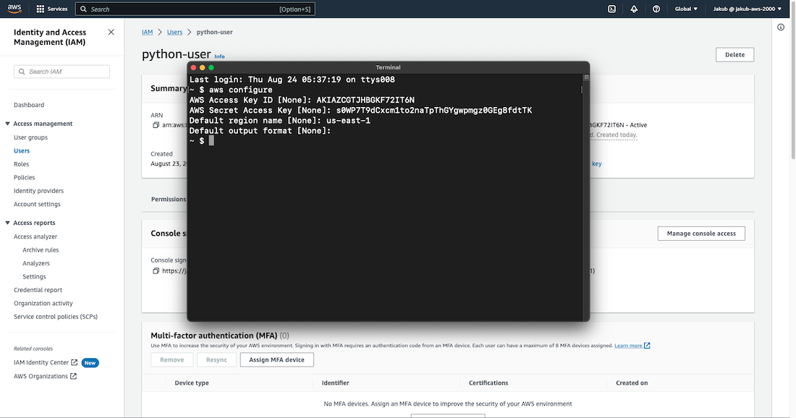
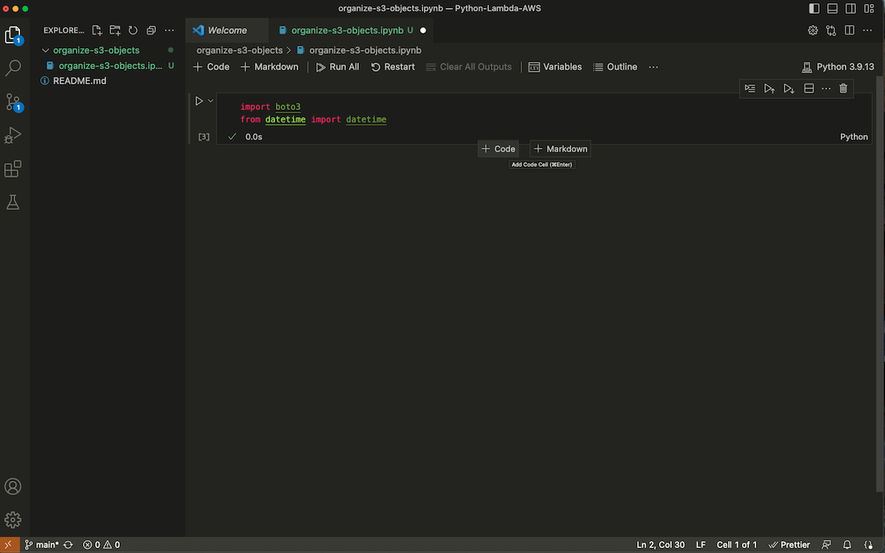

**AWS Lambda** is a **serverless**, **event-driven** compute service that allows you to run code for almost any type of application or backend service without having to provision or manage servers. You can trigger Lambda from over **200 AWS services** and software as a service (SaaS) applications, and only **pay for what you use**.

In this project, you will learn how to write Python code and use AWS Lambda to automate tasks. You will create a Lambda function that triggers whenever a file is added to an S3 bucket.

<span disclaimer>Disclaimer</span><em>Please be aware that there may be some small charges associated with the services we will be using. To avoid any unnecessary charges, kindly remember to delete all services used when the project is completed. Additionally, 
to have even more control over your spending, you can <a class="scroll__link" href="/scrolls/aws-budget" target="_blank">create a budget on AWS</a>. This will allow you to keep track of your usage and spending in real-time.</em>

If you don't have an AWS account yet, don't worry! Check out this <a class="scroll__link" href="/scrolls/aws-account" target="_blank">quick guide</a> to create one, and then come back here to follow the steps. Let's do it then!

<h2 class="scroll__subheading">Lambda Automation Havens</h2>

- <a class="scroll__link" href="#python&boto">1. Install Python 3 and Boto3</a>
- <a class="scroll__link" href="#iam-user">2. Create Programmatic Access IAM User</a>
- <a class="scroll__link" href="#python-script">3. Write Python Script</a>
- <a class="scroll__link" href="#lambda">4. Create Lambda Function</a>

<h2 id="python&boto" class="scroll__subheading scroll__subheading--section">Python 3 and Boto3 Installation</h2>

To start this project, you should already have **Python 3** installed on your computer. Additionally, in order to manage and create resources on AWS with Python, you need to install **Boto3**. First, search for Python 3 and then for Boto3 on Google, and install them by pasting the installation commands available on their websites into your terminal.

**Boto3** is the Amazon Web Services (AWS) **Software Development Kit (SDK)** for Python, which enables Python developers to write software that utilizes services like Amazon S3 and Amazon EC2.

As a fun fact, Boto (pronounced boh-toh) was named after the freshwater dolphin native to the Amazon river. The name was chosen by the author of the original Boto library, Mitch Garnaat, as a reference to the company.

<h2 id="iam-user" class="scroll__subheading scroll__subheading--section">IAM User with Programmatic Access</h2>

To use Python for creating resources in an AWS account, we need to create an **IAM user** with programmatic access in the AWS account. First, in the search bar look for the <q>iam</q> service and then, on the IAM dashboard, click on **Users** on the left-hand menu, and select **Create user**. In **Step 1** we'll need to enter a **User name**, select the option **Provide user access to the AWS Management Console**, and check **I want to create an IAM user**. Click on **Next**. In the next step, select **Attach policies directly**, and in the **Permissions policies** section, check **AdministratorAccess**. In the last step, click on **Download .csv file** to obtain the credentials for the user.


#### AWS Command Line Interface

Next step would be to install **AWS Command Line Interface** on our computer.

The AWS Command Line Interface (AWS CLI) is a super handy tool for managing all your AWS services. With just one tool to download and set up, you can easily control multiple AWS services from the command line of your terminal and even automate them using scripts. Isn't it cool? ;)

In the search bar look for the <q>aws command line</q>, scroll down to the **Documentation** section, and select **AWS Command Line Interface**. On the next page, you should see the **Get started** option on the left-hand menu. Click on it. Select your operating system and click on the link to download the pkg file. After downloading, we need to open the file and follow the instructions to install it on our computer.


#### IAM User Credentials Configuration

To get access to AWS services from AWS CLI we have to configure AWS IAM user credentials on our computer. To do this, we need to obtain an **access key**. Start by going to the **IAM Users** page, select our new user, and then click on **Create access key**. On the next page, choose **Command Line Interface (CLI)**, check **Confirmation** at the bottom, and click **Next**. Add a **Description tag value**, and then click **Create access key**. Finally, on the next page, download the .csv file by clicking **Download .csv file** at the bottom, and then click **Done**.


Once the access keys are created, we can go to the terminal and finally use **AWS CLI**. Type <q>aws configure</q> and press enter. We'll be prompted to enter our **Access Key ID**, **Secret Access Key**, and **Default region name**.



#### Amazon Simple Storage Service (S3)

Alright, let's return to the AWS console to create an **S3 bucket**. We will upload files to this bucket and create our lambda function to organize them.

**Amazon Simple Storage Service (Amazon S3)** is an object storage service that provides top-notch **scalability**, **data availability**, **security**, and **performance**. You can utilize Amazon S3 to store and retrieve any volume of data at any given time and from any location.

To create an S3 bucket, first, search for <q>s3</q> in the search bar at the top and select S3. Then, click on **Create bucket**. Next, enter a unique name for your bucket, choose the AWS Region, and leave the other fields as default. Finally, click on **Create bucket** at the bottom.


Now select your newly created bucket and click the **Upload** button to add files. You can either drag and drop files from your computer into the designated area or click **Add files** to choose them. Finally, click **Upload** to complete the process.


<h2 id="python-script" class="scroll__subheading scroll__subheading--section">Code Editor and Python Script</h2>

In the next step we are going to write the actual Python script to organize our S3 files when the Lambda function gets triggered. For this job, we're going to need a code editor. I recommend using **Visual Studio Code**, but you can use others as well.

Open the code editor and search for the **Jupyter** extension, then install it. After that, search for **Pylance** and install it as well. We will be using Jupyter to experiment with the code and write **executable** Python source code to check if it's doing what we expect.


Create a new folder and a file inside, just like in the screenshot. Remember to use the **.ipynb** file extension. On the right side, type the import commands. Then click on the run button and then on Install.




To get to the next field to write your code, move your mouse to the bottom of the actual field until two buttons appear, then click on **+ Code**. To run the code, click on the run button on the left to check if it’s working fine.


The script uses methods from the official **Boto3** documentation page. It's a good idea to spend some time experimenting with various methods to become comfortable with accessing your S3 bucket and managing objects directly from the code editor.


Essentially, the script creates a folder in the S3 bucket with today's date as its name if the folder doesn't exist yet. Then, it creates a list of object names and loops through it. If an object's upload date matches today's date, it copies the object to the created folder and then deletes it from the initial directory.


```
import boto3
from datetime import datetime

today = datetime.today()
todays_date = today.strftime("%Y%m%d")

client_s3 = boto3.client('s3')
bucket_name = "my-aws-bucket-jakub-folta-project"
s3_objects_response = client_s3.list_objects_v2(Bucket=bucket_name)
response_contents = s3_objects_response["Contents"]
directory_name = todays_date + "/"

def lambda_handler(event, context):
    bucket_objects = []

    for item in response_contents:
        bucket_objects.append(item["Key"])

    if directory_name not in bucket_objects:
        client_s3.put_object(Bucket=bucket_name, Key=directory_name)

    for item in response_contents:
        item_name = item["Key"]
        item_upload_date = item["LastModified"].strftime("%Y%m%d")
        
        if item_upload_date == todays_date and not directory_name in item_name:
            client_s3.copy_object(
                Bucket=bucket_name,
                CopySource=bucket_name + "/" + item_name,
                Key=directory_name + item_name
            )
            client_s3.delete_object(
                Bucket=bucket_name,
                Key=item_name
            )

lambda_handler(event='fds', context="fds")
```

After pasting the code into your code editor, click the run button. If everything worked properly, you should see a green checkmark in the bottom left corner of the field where you pasted the script. When you go back to the S3 panel and select your bucket, you should see that a new folder was created and inside it are the files you uploaded previously.


If everything is working correctly, we can convert our script to Python format for the AWS Lambda service. Click on the three dots next to the **Outline** tab, then click **Export** and choose **Python Script**. A new Python file will be created containing our script. Press **ctrl + s** to save the file, name the file, and click **Save**.


Next, navigate to the directory where this file was created and compress it to create a zip file. Then, return to the **S3** console and create a new bucket where we can upload this compressed zip file.


<h2 id="lambda" class="scroll__subheading scroll__subheading--section">AWS Lambda</h2>

Alright, let's set up automation for this task using the Lambda service. This means that every time a file is uploaded to our bucket, the Lambda service will run our function and organize the S3 bucket objects.

#### IAM Role

Navigate to the **IAM** service and click on **Roles**. Then, click on **Create role**. By creating a role and assigning it to some services, we are essentially giving them permission to perform actions in AWS, similar to when creating a new user with specific permissions. In this case, we are giving permission to the Lambda service.

On the next page, select **AWS service**, then choose **Lambda** from the dropdown list at the bottom, and click on **Next**. Now, filter policies by typing <q>s3</q> first and selecting **AmazonS3FullAccess**. Then type <q>lambda</q> and select **AWSLambdaBasicExecutionRole**. Click on **Next** at the bottom. On the last page provide a **Role name**,  double-check that your policies are selected, and then click on **Create role**.


#### Lambda Function

Now, let's create a Lambda function. Search for lambda service in the search bar and select it. Click on **Create a function**, provide the **Function name**, select the **Runtime** python version, and click on **Change default execution role**. Select **Use an existing role** and then choose our previously created role from the list. Click on **Create function** to complete the process.


In the next step we are going to add a trigger to invoke our Lambda function. Click on **Add trigger**, type <q>s3</q> in the field, and select it from the list. Then in the **Bucket** field choose our first bucket where we upload files. For **Event types**, choose **PUT** event. Check the terms box at the bottom and click on **Add**.


Now, on our Lambda function page, right-click on the default Python file at the bottom and delete it.


To add our Python file, we need to get the URL to our compressed Python file in the S3 bucket. Let’s go to the S3 page, select our bucket with the compressed file, select it, and on the **Properties** tab, click on the copy button to get the URL. Then, go back to the Lambda page.


Click on the **Upload from** button and select **Amazon S3 location**. Paste the URL in the field and click on **Save**. By right-clicking on our file and selecting **Open**, we can see that our file is uploaded. Scroll down to the **Runtime settings** section and click on **Edit**. We have to update the **Handler** field because right now it’s pointing to the default lambda function filename. Update it appropriately so it matches our file and function name and click on **Save**.


We can finally test our solution. Go back to the S3 service, select the bucket to which we are uploading files, and then upload some. They should be immediately moved to the proper folder, or if not, click the refresh button.

This is it. I hope you find this helpful ;). Thanks for reading!
