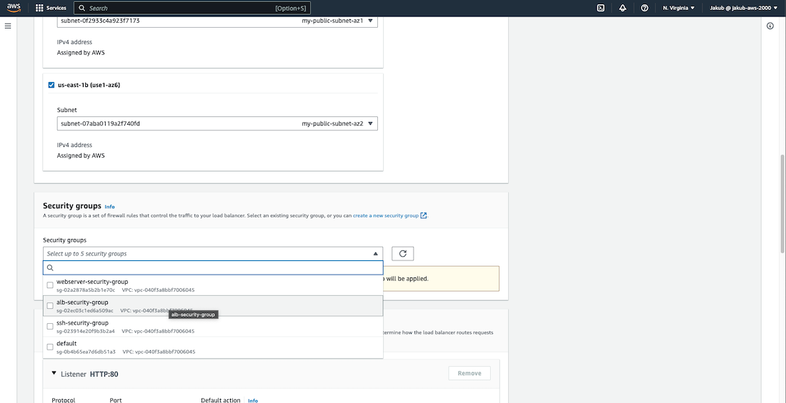
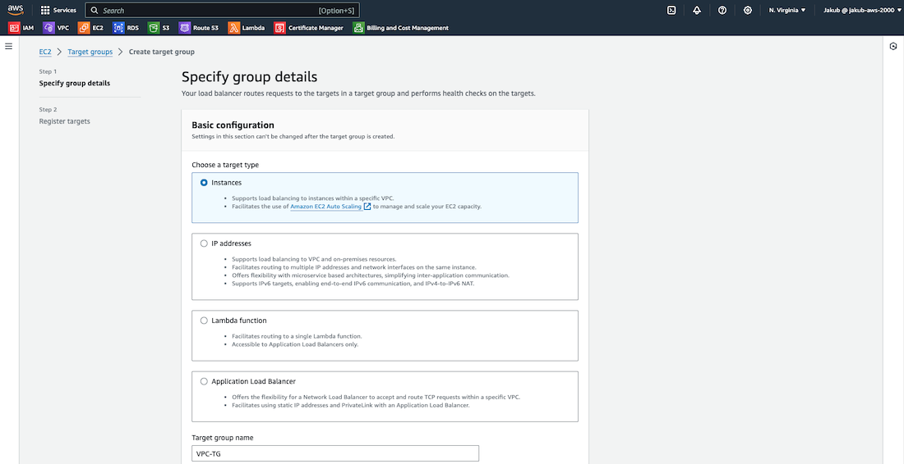

Throughout this project, you will gain practical knowledge on how to deploy an HTML website on AWS. The project will involve hands-on experience with essential AWS services such as the setup of **VPC**, public and private subnets, **security groups**, **EC2 instances**, **NAT gateways**, and **Application Load Balancers**. Moreover, you will learn about **Route 53**, **Certificate Manager**, and **Auto Scaling groups**, which will help you gain foundational knowledge of AWS website hosting. This project is perfect for beginners who want to gain practical experience and a better understanding of AWS website hosting.

This project will be built using a **3-tier architecture**. The first tier, known as the **Web/Presentation Tier**, is responsible for user-facing elements of the app such as web servers and the interface/frontend. The second tier, known as the **Application Tier**, is responsible for the backend and application source code. Finally, the **Data Tier** is responsible for storing and managing application data.

Implementing this architecture offers several benefits, including increased **scalability**, **availability**, and **security**. By distributing the application across multiple Availability Zones and dividing it into three layers that perform different functions independently, the application can continue to run even if one Availability Zone goes down. Each tier is assigned its own security group that only allows relevant inbound/outbound traffic, ensuring the application is secure. If required, the application can automatically scale resources to another Availability Zone without affecting other application tiers.

<span disclaimer>Disclaimer</span><em>Please be aware that there may be some small charges associated with the services we will be using. To avoid any unnecessary charges, kindly remember to delete all services used when the project is completed. Additionally, 
to have even more control over your spending, you can <a class="scroll__link" href="/scrolls/aws-budget" target="_blank">create a budget on AWS</a>. This will allow you to keep track of your usage and spending in real-time.</em>

Okay, it's time to get to the main point of this article, which is to guide you on how to host your first static website on AWS. But, if you don't have an AWS account yet, don't worry! Check out this <a class="scroll__link" href="/scrolls/aws-account" target="_blank">quick guide</a> to create one, and then come back here to follow the steps. Let's begin!

<h2 class="scroll__subheading">Our Havens</h2>

- <a class="scroll__link" href="#3-tier-architecture">1. Create a 3-tier Architecture</a>
- <a class="scroll__link" href="#nat-gateways">2. Create Nat Gateways</a>
- <a class="scroll__link" href="#security-groups">3. Set up Security Groups</a>
- <a class="scroll__link" href="#ec2&alb">4. Create EC2 instances and an ALB</a>
- <a class="scroll__link" href="#register-new-domain">5. Register New Domain in Route 53</a>
- <a class="scroll__link" href="#ssl-certificate">6. Register an SSL Certificate in AWS Certificate Manager</a>
- <a class="scroll__link" href="#https-listener">7. Create an HTTPS Listener for an ALB</a>
- <a class="scroll__link" href="#asg">8. Set up an Auto Scaling Group</a>

<h2 id="3-tier-architecture" class="scroll__subheading scroll__subheading--section">AWS 3-tier architecture</h2>

#### VPC Creation

In the search bar, look for <q>vpc</q>. In the VPC dashboard, click on **Create VPC**, pass the name and set the **IPv4 CIDR** to 10.0.0.0/16. Scroll down and click on **Create VPC**.


#### DNS Hostnames

Next, we need to enable **DNS hostnames** for this VPC. Click on the **Actions** button located in the top-right corner and select **Edit VPC settings** from the list. On the following page, you'll see an option **Enable DNS hostnames**, tick the box and click on **Save**. By enabling this option, we'll be able to set up DNS in our VPC.


#### Internet Gateway

To enable communication with the internet, we need to create an **Internet Gateway** and attach it to our VPC. To get started, click on **Internet Gateways** from the left-hand menu and then select **Create Internet gateway**. On the next page, provide a name and click on **Create Internet Gateway** to complete the process.


Now, we need to attach the Internet Gateway to our VPC for it to function properly. Click on **Actions** and select **Attach to VPC**. From the drop-down menu, select our VPC and confirm the settings by clicking on **Attach Internet Gateway**. That's it! We're done here, let's move on.


#### Public Subnets

Next, we are going to create two public subnets in our VPC for high availability. To get started, select **Subnets** and make sure to filter the VPC and select our VPC to ensure that no other subnets are listed. Then click on **Create subnet**. On the next screen, select your VPC, provide a name, choose the availability zone, and enter the IPv4 CIDR. Scroll down and click on **Create subnet**. After this, we need to create a second subnet in a different availability zone to ensure high availability for our website.


Once this is done, we need to enable auto-assign IP setting. To do this, choose one subnet, click on **Actions**, and select **Edit subnet settings**. Check **Enable auto-assign public IPv4 address** and save this setting. Repeat this action for the second subnet.


#### Route Tables

To manage the network traffic flow between subnets, we require a set of rules that dictate the direction of the traffic. These rules are defined using **Route Tables**. Each subnet in our VPC is associated with a specific route table that controls the traffic flow between subnets.

To create a route table, we need to follow these steps. First, go to the **Route tables** option and click on the **Create route table**. If you have already created a VPC, you should have a route table as well. On the next screen, the user needs to provide a name for the new route table and select the VPC. After that, click on **Create route table**.


Next, we need to add a public route to the route table to direct traffic to the internet. To do this, select the newly created route table and click on **Edit routes** in the **Actions** drop-down menu. We need to allow traffic to and from the internet, so after clicking on **Add route**, the user must add **0.0.0.0/0** as the destination for the internet. Then, the user should search for the Internet gateway which facilitates communication between instances in the VPC and the internet and add it as the target. Finally, click on **Save changes**.


Now we have to associate our public route table with our subnets. To do this, select the public route table, click on **Subnet associations**, and then click on **Edit subnet associations**. On the next screen, select the two public subnets and confirm by clicking on **Save associations**.


#### Private Subnets

In the next step, we will create 4 private subnets. Two of them will be in us-east-1a AZ, with one subnet to hold EC2 and another subnet to hold our data, and the remaining two will be in us-east-1b AZ, which will be the same as in the first AZ.

To create these subnets, you need to select **Subnets** from the left menu and click on **Create subnet**. On the next screen, fill in the required fields, similar to how we created the public subnets. Select the VPC, provide a name, select the AZ and provide an IPv4 CIDR block that is different from the previously created CIDR blocks. Scroll down and click on **Create subnet**.

Repeat the same steps for the next three private subnets, but change the name, AZ, and IPv4 CIDR block. Please refer to the screenshots and architecture diagram for reference and make sure that the subnets are in the correct AZs.


Although all six subnets may appear to be the same, the difference is that the first two subnets are public and have an association with the route that enables communication to and from the internet. The remaining four subnets are implicitly associated with the Main Route Table, which is private by default and has a route that routes traffic locally within the VPC. It doesn't have a route to the internet like our public route table.

<h2 id="nat-gateways" class="scroll__subheading scroll__subheading--section">Nat Gateways</h2>

To allow access to the internet in our private subnets we will be creating **NAT Gateways**, also known as **Network Address Translation Gateways**. Unlike the Internet Gateway, NAT Gateway only allows **outbound access**.

To create NAT Gateways, select **Nat gateways** on the left-side menu, click on **Create NAT gateway**, pass the name, select public subnet in AZ1, and click on the **Allocate Elastic IP** button to assign an elastic IP. Click on **Create NAT gateway** and repeat the steps to create a second NAT gateway, changing the name and subnet to our public subnet in AZ2. Check the screenshot for reference.


#### Private Route Tables

Now we need to create explicit route tables for our private subnets, which would direct traffic to Nat Gateways so that instances in our private subnets can access the internet through the Internet Gateway. To do this,
follow the same steps used to create the first route table, but with a different name. Once that is done, repeat the process for the second private route table.


With private route tables created, we are going to create a route for our private route table in AZ1 that will point to the NAT gateway in AZ1. To do this, select the private route table in AZ1, click on **Routes** and **Edit routes**. On the next screen, click on **Add route** and pass the IPv4 CIDR block for the internet traffic so 0.0.0.0/0, and select the NAT gateway created for AZ1 as the target. Click on **Save changes**. Repeat these steps to create a new route for our private route table in AZ2.


Finally, we have to associate these route tables with our private subnets in AZ1 and AZ2. To do this, select the private route table for AZ1 and associate it with our two private subnets in AZ1. Repeat this step for the private route table in AZ2. Check the screenshots for reference.


<h2 id="security-groups" class="scroll__subheading scroll__subheading--section">Security Groups</h2>

To ensure that the traffic reaching and leaving associated resources is secure, we need to create **Security Groups**. Once we've associated a security group with some AWS service, it will control the inbound and outbound traffic for that service. Think of a security group as a **Virtual Firewall**. It has a set of configurable rules that can be used to monitor and filter incoming and outgoing traffic for an instance, similar to how a traditional firewall works.

We need to create security groups for our EC2 instances, Application Load Balancer, and SSH. 

First one will be **ALB security group**. To do this, navigate to the VPC dashboard and select **Security Groups** from the left menu. Click on the **Create Security Group** button and provide a name, description, and select our VPC. In the **Inbound Rules** section, click on **Add Rule** and select **HTTP** as the Type, which always uses **Port 80**. For Source, enter the IP address **0.0.0.0/0** so basically all IPv4 addresses. Next, add a second rule for **HTTPS** on **Port 443** and the same Source address. Then, scroll down and click on **Create Security Group**.


To create an **SSH security group** on **Port 22**, repeat the previous steps, but for the Type, select SSH. For the Source, select My IP. Scroll down and click on Create Security Group.


Finally, we will create an **EC2 security group**. In the Inbound Rules section, add two new rules, one for a **HTTP** type and another one for the **HTTPS** and search for the newly created **ALB security group** as the **Source** for them. This way, we allow traffic to our EC2 instances only from our ALB security group. Repeat this process for the last rule for **SSH** type and select **SSH security group** as the **Source**. Click on Create Security Group to finish setup.


<h2 id="ec2&alb" class="scroll__subheading scroll__subheading--section">Elastic Compute Cloud and Application Load Balancer</h2>

In our architecture, we need to incorporate an **Elastic Compute Cloud (Amazon EC2)**, which is a service provided by Amazon Web Services (AWS). This service facilitates on-demand, flexible computing capacity in the cloud, which can help reduce hardware costs and allows for faster application development and deployment. With Amazon EC2, you can easily launch virtual servers, set up security and networking, and manage storage. You can also increase computing capacity to handle heavy workloads and website traffic spikes, and decrease capacity when usage goes down.

We will also utilize an **Application Load Balancer (ALB)**, which operates at the **application layer (HTTP/HTTPS)** and offers advanced traffic routing capabilities. This load balancer is an excellent choice for modern, microservice-based applications that require sophisticated routing and scaling features.

A load balancer acts as a single point of contact for clients, distributing incoming application traffic across multiple targets (such as EC2 instances) in multiple Availability Zones to increase application availability. Furthermore, the load balancer monitors the health of its registered targets and routes traffic only to healthy targets.

#### EC2 Instances

To create two EC2 instances, first type <q>ec2</q> in the search bar at the top and select it from the list. On the next screen, click on the **Launch instance** button.


In the **Name and tags** section at the top, click on **Add additional tags** and pass some descriptive name as the value. Check the boxes for **Instances**, **Volumes**, and **Network interfaces** for **Resource types**. Move to the **Application and OS Images** section. Select **Amazon Linux 2023 AMI** as the Amazon Machine Image. Further down, set the **Instance type** to **t2.micro**. In the **Key pair** section, click on **Create new key pair** and give it a name.


In the **Network settings**, select your VPC and the private subnet in AZ1. For the **Firewall (security groups)**, choose **Select existing security group** and select security group created for EC2 from the drop-down menu.


Now scroll down to the **Advanced details** section, click on it, and scroll all the way down. In the **User data** field, paste the following bash script:

```
#!/bin/bash
sudo su
yum update -y
yum install -y httpd
cd /var/www/html
wget https://github.com/jakubfolta/Webpage-Yatsu/archive/refs/tags/v1.0.0.0.zip
unzip Webpage-Yatsu-1.0.0.0.zip
cp -r Webpage-Yatsu-1.0.0.0/* /var/www/html/
rm -rf Webpage-Yatsu-1.0.0.0 Webpage-Yatsu-1.0.0.0.zip
systemctl enable httpd 
systemctl start httpd
```


Click on **Launch instance** to create our first EC2 instance.

To create the second EC2 instance, repeat all the previous steps, but this time change the value for the tag, select the private subnet in AZ2 and choose the created key pair. 

#### ALB

To route traffic to our EC2 instances, the next step is to launch an **Application Load Balancer**. To do this, navigate to the **Load Balancers** option in the left side menu and click on **Create Load Balancer**. From there, select the **Create button** under Application Load Balancer.


Pass the name and in the **Network mapping section**, choose our VPC and select the public subnet in AZ1 and the public subnet in AZ2 respectively for the availability zones. For the **Security groups** field, select our ALB security group.




Moving on to the **Listeners and routing** section, click on **Create target group** for **HTTP**. On the following page, ensure that you have chosen **Instances** as the target type to route traffic to our EC2 instances. Enter a name and select our VPC. Then, click on **Next**, in the next step select our instances as targets, and click on **Include as pending below** button. Finally, click on **Create target group** at the bottom of the page.




Now, head back to our **Listeners and routing** section and click on the **Refresh** button. Select our newly created target group and click on **Create Load Balancer** at the bottom of the page. We're done here ;)


<h2 id="register-new-domain" class="scroll__subheading scroll__subheading--section">Custom Domain in Route 53</h2>

To register our own domain name and avoid using the DNS name of ALB to access our webpage, we can use **Route 53 service**. To start, type <q>route 53</q> in the search bar and select it from the list. On the next page, in the **Register domain** section, enter the domain name you would like to have and click on the **Check** button to check its availability. If it's available, click **Select** next to the domain you'd like to buy, then click **Proceed to checkout**. On the next page, click **Next** and enter your Registrant contact details. Click **Next** at the bottom, then review your details on the **Review and submit** page. Check the terms and conditions, then click **Submit**. On the next page, click **Check status** to confirm that your domain is ready. It may take up to 15 minutes for your domain to be ready.


Once your domain is ready, create a record set to point your domain name to ALB. To do this, select **Hosted zones** on the left menu, then click on your domain name. Click **Create record**, then follow these steps: 

- 1.&nbsp;Enter **www** as the record name.
- 2.&nbsp;Turn on the **Alias** and select **Alias to Application and Classic Load Balancer**.
- 3.&nbsp;Choose the region in which your instances were created.
- 4.&nbsp;Select your ALB from the drop-down list.
- 5.&nbsp;Click **Create records**.


After that, check the box next to your new record and click on the **Copy** button next to your webpage URL. You can then paste it into the search bar and you should be redirected to your webpage.


<h2 id="ssl-certificate" class="scroll__subheading scroll__subheading--section">SSL Certificate in AWS Certificate Manager</h2>

To encrypt communication between our webpage and the browser, we need to obtain an **SSL certificate**. To register for a free SSL certificate, search for <q>certificate manager</q> in the search bar. Next, click on **Request a certificate** and then click **Next**. In the **Domain names** section, enter the new domain and click **Request** at the bottom.


After this, on the **Certificates** page, click on the **View certificate** button and then click **Create records in Route 53** to complete the validation of the certificate. On the next page, ensure that your domains are selected and click **Create records**. Once you refresh the webpage, you should see that the status for your certificate is **Issued**.


<h2 id="https-listener" class="scroll__subheading scroll__subheading--section">HTTPS Listener for an ALB</h2>

After obtaining an SSL certificate, we can now add an **HTTPS listener** to our **Application Load Balancer (ALB)**. To do this, we need to go to the EC2 dashboard and select Load Balancers. From there, we should proceed to the Listeners and rules section and click on the **Add listener** button. On the next page, select **HTTPS** and the target group for the ALB. Scroll down and in the **Secure listener settings**, select **From ACM** and then choose our **SSL certificate** from the next box. Click **Add** to create the HTTPS listener.


To ensure that only encrypted connections are allowed and users' data is protected, we need to forward traffic from HTTP to HTTPS. To do this, select the HTTP:80 listener and then click on **Actions**, and **Edit listener**. On the next page, change the action type to **Redirect to URL** and set the protocol and port as **HTTPS** and **443**. Click **Save changes** to save your settings.


Finally, we can check if our redirecting is working by using the URL provided, which in my case is https://www.mynewawswebsite.click/.

<h2 id="asg" class="scroll__subheading scroll__subheading--section">Auto Scaling Group</h2>

To ensure the health and availability of our webpage, the final step is to create an **Auto Scaling group (ASG)**. An Auto Scaling group is a collection of EC2 instances that work as a logical grouping for automatic scaling and management. This group also allows you to use Amazon EC2 Auto Scaling features such as **health check replacements** and **scaling policies**.

To create the Auto Scaling group, we need to provide a **Launch Template**. To do this, select the **Launch Templates** option from the left-hand side menu, and then click on **Create launch template**. Provide a name, check the **Provide guidance to…** box, and select the same settings we used when <a class="scroll__link" href="#ec2&alb">creating EC2 instances</a>. Finally, click on **Create launch template**.


Now to proceed, select the **Auto Scaling Groups** option on the left-hand menu at the bottom and click on **Create Auto Scaling group**. Next, enter the name and select the launch template. Then, click on the **Next** button. Choose our VPC and select the private subnets in AZ1 and AZ2. Click on **Next**.


Under **Attach to an existing load balancer**, select our ALB target group from the list. In the **Health checks** section, check the **Turn on Elastic Load Balancing health checks** option. Under **Additional settings**, check the **Enable group metrics collection within CloudWatch** option.


**Amazon CloudWatch** monitors your Amazon Web Services (AWS) resources and the applications you run on AWS in real-time. You can use CloudWatch to **collect** and **track metrics**, which are variables you can measure for your resources and applications. With CloudWatch, you gain system-wide visibility into resource utilization, application performance, and operational health.

Move on by clicking on **Next**.

In the **Group Size** option choose the capacity you desire. Once done, click on the **Next** button. On the **Add Notifications** page, you can set up email notifications in case of an autoscaling event. Simply click on **Add Notification**, then **Create Topic**. Enter the name and email address where you would like to receive notifications and click **Next**.


To make it easier to identify instances created by ASG, add a **tag**. Click **Next**. After reviewing all the details on the **Review** page, click on **Create Auto Scaling Group**. Now, if you select **Instances** from the left-hand menu, you should be able to view all your instances. You will see that half of them were created manually and the other half were created by your ASG.


#### Simple Notification Service

Let's check if everything is working correctly. First, we need to inspect the **Simple Notification Service (SNS)**.

Amazon Simple Notification Service (SNS) is a managed service that delivers messages from **publishers** to **subscribers**, also known as **producers** and **consumers**. Publishers communicate asynchronously by sending messages on a topic that serves as a logical access point and communication route for subscribers.

Type <q>sns</q> in the search bar and select appropriate service, then select **Topics** from the menu. Click on our topic to see that our subscription to this topic requires confirmation. Confirm it by clicking on the link inside the AWS email. After refreshing our topic page, we should see that our subscription is confirmed.


To ensure that our Auto Scaling Group (ASG) is properly configured, let's terminate three instances. Go back to **EC2 service** page, click on the **Instances**, select three instances, click on the **Instance state** at the top and select **Terminate instance**. After a few minutes, we should see that a new instance was created. We can also check our **ASG** activity by selecting our ASG and clicking on the **Activity** tab. Additionally, we should receive an email informing us about ASG activity.


#### Final Step

Alright, our three-tier architecture is complete, and the website is now live ;). It's time to delete all resources on AWS to avoid being charged excessively for them. To do this, we basically need to select each resource and click on **Actions** and then on **Delete**.

On the **EC2** page, delete the **ASG**, **Launch Template**, **ALB**, and **Target Group**. On the **VPC** page, delete the **Security Groups** (first the web server security group, and then the rest), **Nat Gateways**, **VPC**, and release the **Elastic IP**. Finally, delete the record set in **Route 53**. To do this, go to the Route 53 page, select the created hosted zone, and delete the record with **Type A**, which is redirecting our domain name to ALB that has already been deleted.

Thanks for reading.
